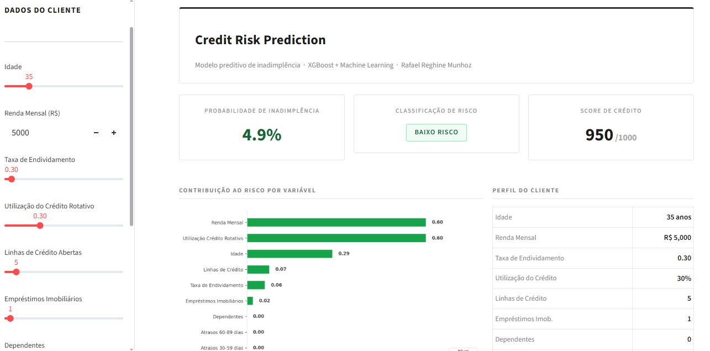
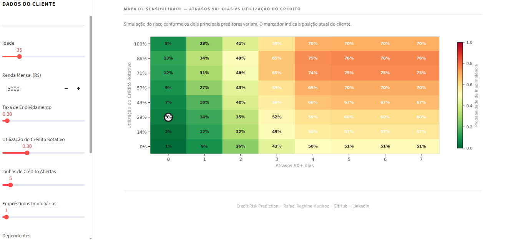

# Credit Risk Prediction — Loan Default Analysis


Modelo de Machine Learning para previsão de inadimplência de crédito, com aplicação interativa desenvolvida em Streamlit.

---

## Preview

### Dashboard Principal


### Mapa de Sensibilidade


---

## Contexto de Negócio

Instituições financeiras precisam avaliar o risco de crédito antes de conceder empréstimos. Um modelo preditivo eficiente permite:

- Reduzir perdas com inadimplência — liberar crédito para mau pagador (falso negativo)
- Evitar rejeições desnecessárias — negar crédito para bom pagador (falso positivo)
- Otimizar a política de concessão de crédito com base em dados

**Pergunta de negócio:** Dado o perfil financeiro de um cliente, qual a probabilidade de inadimplência nos próximos 2 anos?

---

## Dataset

**Give Me Some Credit — Kaggle**

- 150.000 registros de clientes reais
- 10 variáveis financeiras e comportamentais
- Problema de classificação binária — default: sim/não
- Dataset desbalanceado (~6.7% de inadimplentes)

[Download do dataset](https://www.kaggle.com/competitions/GiveMeSomeCredit/data)

---

## Estrutura do Projeto

```
credit-risk-prediction/
│
├── models/
│   ├── best_model.pkl
│   ├── scaler.pkl
│   └── imputer.pkl
├── Credit_Risk_Analysis.ipynb
├── app.py
├── requirements.txt
├── preview_dashboard.png
├── preview_heatmap.PNG
└── README.md
```

---

## Fluxo do Projeto

```
Dados Brutos → EDA → Pré-processamento → SMOTE → Modelagem → Avaliação → Deploy
```

### 1. Análise Exploratória (EDA)
- Distribuição das variáveis e target
- Taxa de inadimplência por faixa etária
- Impacto do histórico de atrasos na inadimplência
- Matriz de correlação entre variáveis

### 2. Pré-processamento
- Tratamento de valores nulos via imputação por mediana
- Tratamento de outliers com clip no percentil 99
- Balanceamento de classes com **SMOTE**

### 3. Modelagem — 3 algoritmos comparados

| Modelo | AUC-ROC |
|---|---|
| Regressão Logística (baseline) | ~0.82 |
| Random Forest | ~0.86 |
| **XGBoost** ⭐ | **~0.87** |

### 4. Aplicação Streamlit
- Input de dados do cliente via sidebar
- Probabilidade de inadimplência em tempo real
- Score de crédito (0 a 1000)
- Gráfico de contribuição ao risco por variável
- Mapa de sensibilidade interativo — atrasos vs utilização do crédito

---

## Principais Insights

- **Atrasos graves (90+ dias)** são o maior preditor de inadimplência
- **Alta utilização do crédito rotativo** (acima de 80%) indica stress financeiro
- **Clientes mais jovens** (abaixo de 30 anos) apresentam maior taxa de inadimplência
- Combinação de alta taxa de endividamento com renda baixa eleva significativamente o risco

---

## Como Executar

```bash
# 1. Clonar o repositório
git clone https://github.com/reghine/credit-risk-prediction.git
cd credit-risk-prediction

# 2. Instalar dependências
pip install -r requirements.txt

# 3. Rodar o notebook para gerar os modelos
jupyter notebook Credit_Risk_Analysis.ipynb

# 4. Iniciar o app Streamlit
streamlit run app.py
```

> O notebook foi desenvolvido no **Google Colab**. Para rodar localmente, instale as dependências do `requirements.txt` antes de executar.

---

## Tecnologias Utilizadas

| Categoria | Ferramentas |
|---|---|
| Linguagem | Python 3.12 |
| Manipulação de dados | Pandas, NumPy |
| Machine Learning | Scikit-learn, XGBoost |
| Balanceamento | imbalanced-learn (SMOTE) |
| Visualização | Matplotlib, Seaborn |
| Deploy | Streamlit |
| Ambiente | Google Colab |

---

## Autor

**Rafael Reghine Munhoz**
Data Analyst | Data Science & Analytics | MBA USP

[](https://linkedin.com/in/rafaelreghine)
[](https://github.com/reghine)
